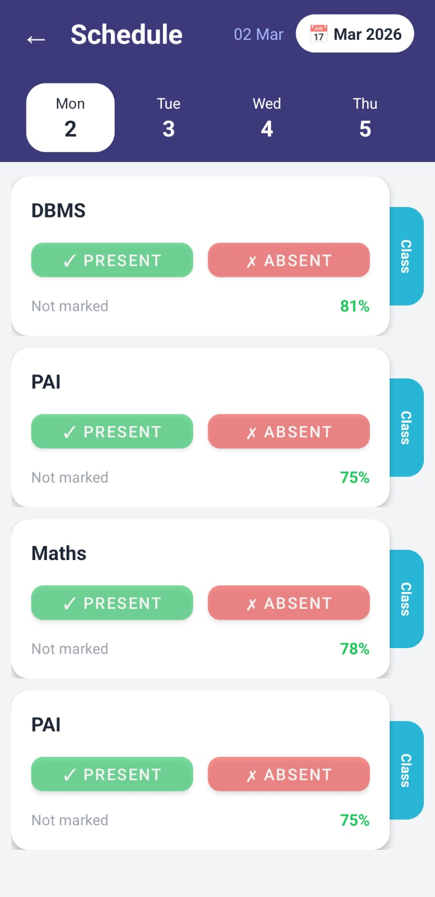
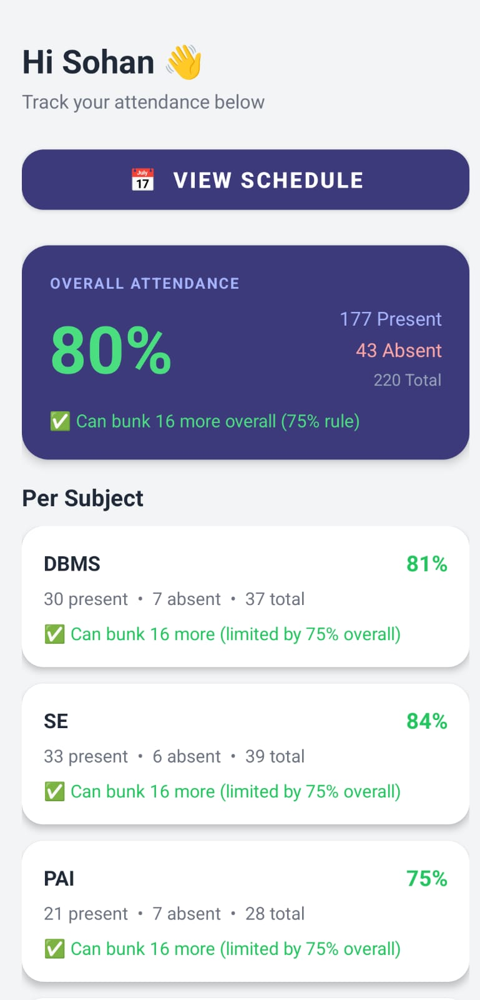

# AttenX — Smart Attendance Tracker

> **Know your limits. Push them smartly.**

AttenX is an offline Android attendance tracker built for students who want to stay on top of their attendance — not panic at the end of semester. Mark present or absent, get instant bunk calculations, export PDF reports, and scan your timetable with your camera.

---

## Screenshots
|  |  |

| Dashboard | Schedule | Setup |
|-----------|----------|-------|
| Overall % + per subject breakdown | Day-wise subjects with mark buttons | Scan or manually add subjects |

---

## Features

### Core
- **Mark attendance** — Present or Absent per subject per day, with instant visual feedback
- **Day strip navigation** — Swipe through the week, tap any day to load its subjects
- **Calendar picker** — Go back to any past date and mark attendance you missed
- **Live % calculation** — Attendance % updates the moment you tap a button, no refresh needed

### Smart Bunk Calculator
- Tells you exactly how many classes you can skip while staying safe
- Respects **two rules simultaneously**:
  - 75% overall attendance
  - 40% per subject minimum
- Shows which rule is the bottleneck per subject
- If you're already below threshold — tells you how many consecutive classes you need to attend to recover

### PDF Export
- Generates a clean, formatted PDF with overall %, per subject breakdown, present/absent/total counts and bunk info
- Share instantly via WhatsApp, Gmail, Google Drive, or any app

### OCR Timetable Scanner
- Take a photo of your printed timetable OR upload from gallery
- ML Kit reads the text on-device (no internet needed)
- Detected subjects appear as chips — deselect any false positives
- Tap Save — subjects are added instantly

---

## Tech Stack

| Layer | Technology |
|-------|-----------|
| Language | Java |
| Database | Room (SQLite) |
| UI | Material Components 3 |
| OCR | Google ML Kit Text Recognition |
| PDF | Android native `PdfDocument` API |
| Architecture | Repository pattern |

---

## Project Structure

```
com.sohan.attendance/
├── data/
│   ├── dao/
│   │   ├── Attendancedao.java
│   │   ├── Subjectdao.java
│   │   └── Timetabledao.java
│   ├── database/
│   │   └── AppDatabase.java
│   └── model/
│       ├── Attendance.java
│       ├── Subject.java
│       └── Timetable.java
├── repository/
│   └── AttendanceRepository.java
├── ui/
│   ├── main/
│   │   └── MainActivity.java          ← Entry point, routes to Setup or Dashboard
│   ├── setup/
│   │   ├── SetupActivity.java         ← Add subjects + assign days
│   │   └── TimetableScanActivity.java ← OCR scanner
│   ├── dashboard/
│   │   └── DashboardActivity.java     ← Overall stats + per subject bunk info
│   ├── schedule/
│   │   ├── ScheduleActivity.java      ← Day strip + subject list
│   │   └── ScheduleAdapter.java       ← RecyclerView adapter for subject cards
│   └── graph/
│       └── GraphActivity.java         ← (Coming soon)
└── util/
    ├── AttendancePdfExporter.java
    └── ExportHelper.java
```

---

## App Flow

```
Launch
  ↓
MainActivity
  ├── No subjects → SetupActivity
  │     ├── Scan timetable (OCR)
  │     └── Manual add subjects + assign days
  └── Subjects exist → DashboardActivity
        ├── Overall attendance %
        ├── Per subject cards with bunk info
        ├── Export PDF
        └── View Schedule → ScheduleActivity
              ├── Day strip (Mon–Sat, synced with calendar)
              ├── Calendar picker for past dates
              └── Present / Absent buttons per subject
```

---

## Database Schema

### `Subject`
| Column | Type | Notes |
|--------|------|-------|
| id | INTEGER | Primary key, auto-generated |
| name | TEXT | Subject name |

### `Attendance`
| Column | Type | Notes |
|--------|------|-------|
| id | INTEGER | Primary key, auto-generated |
| subjectId | INTEGER | FK → Subject.id |
| date | TEXT | Format: `yyyy-MM-dd` |
| isPresent | BOOLEAN | true = present |

Unique index on `(subjectId, date)` — prevents duplicate entries per subject per day.

### `Timetable`
| Column | Type | Notes |
|--------|------|-------|
| id | INTEGER | Primary key, auto-generated |
| subjectId | INTEGER | FK → Subject.id |
| dayOfWeek | TEXT | e.g. "Monday" |

---

## Bunk Calculator Logic

### Can bunk X more classes (subject, 40% rule):
```
X = floor((present × 100 / 40) − total)
```

### Can bunk X more classes (overall, 75% rule):
```
X = floor((grandPresent × 100 / 75) − grandTotal)
```

### Final bunk allowance per subject:
```
canBunk = min(subject limit, overall limit)
```

### Classes needed to recover (if below threshold):
```
X = ceil((threshold × total − 100 × present) / (100 − threshold))
```

---

## Setup & Build

### Prerequisites
- Android Studio Hedgehog or newer
- Android SDK 26+
- Java 11

### Dependencies (build.gradle)
```gradle
implementation 'com.google.android.material:material:1.11.0'
implementation 'androidx.room:room-runtime:2.6.1'
annotationProcessor 'androidx.room:room-compiler:2.6.1'
implementation 'com.google.mlkit:text-recognition:16.0.0'
```

### Build APK
1. Open project in Android Studio
2. Build → Build Bundle(s) / APK(s) → Build APK(s)
3. APK located at `app/build/outputs/apk/debug/app-debug.apk`

### Install on Device
```bash
adb install app/build/outputs/apk/debug/app-debug.apk
```
Or share the APK file directly — enable "Install from unknown sources" on the target device.

---

## Attendance Rules

| Rule | Threshold |
|------|-----------|
| Overall attendance | ≥ 75% |
| Per subject minimum | ≥ 40% |

The bunk calculator satisfies **both rules simultaneously** — the more restrictive one always wins.

---

## Roadmap

- [ ] Home screen widget — mark attendance without opening the app
- [ ] CampX integration — import existing attendance via Accessibility Service
- [ ] Graph view — day-by-day attendance trend per subject
- [ ] Semester management — reset and archive per semester
- [ ] Notification reminders — alert before class starts
- [ ] Multiple profiles — for roommates sharing a device

---

## Built By

**Sohan** — built for personal use, shared with the class.

No ads. No internet required. Your data never leaves your phone.
